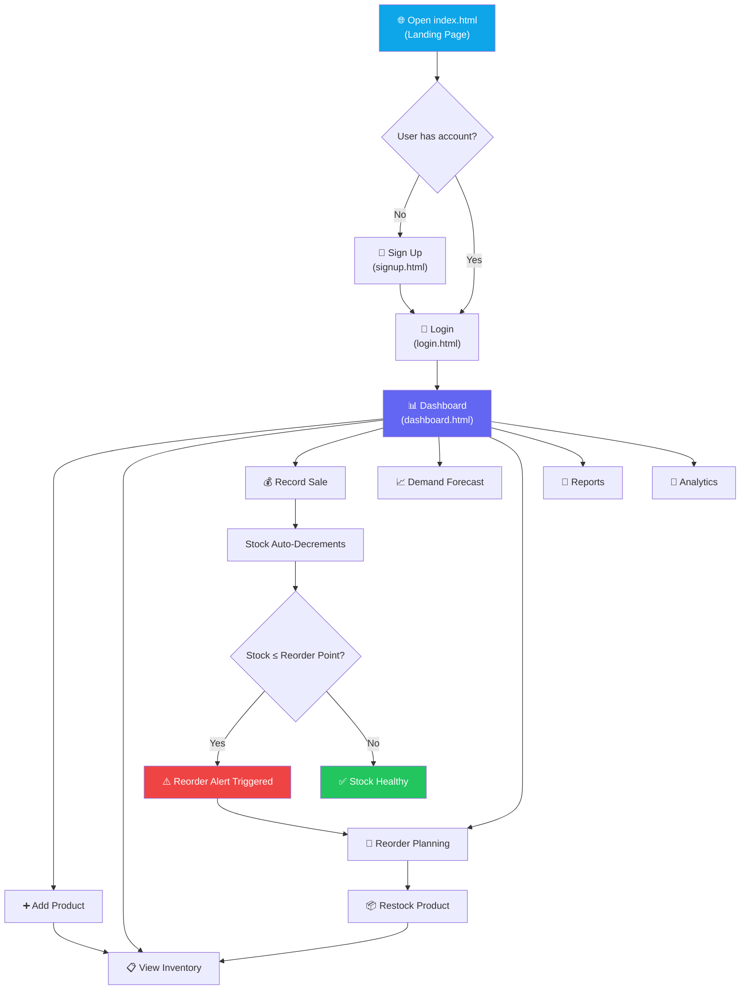
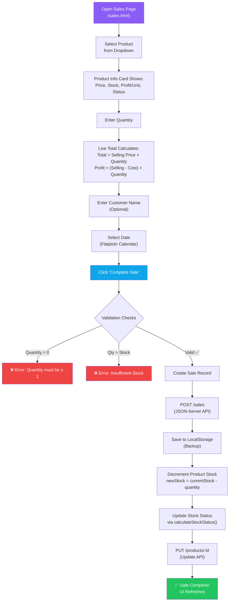
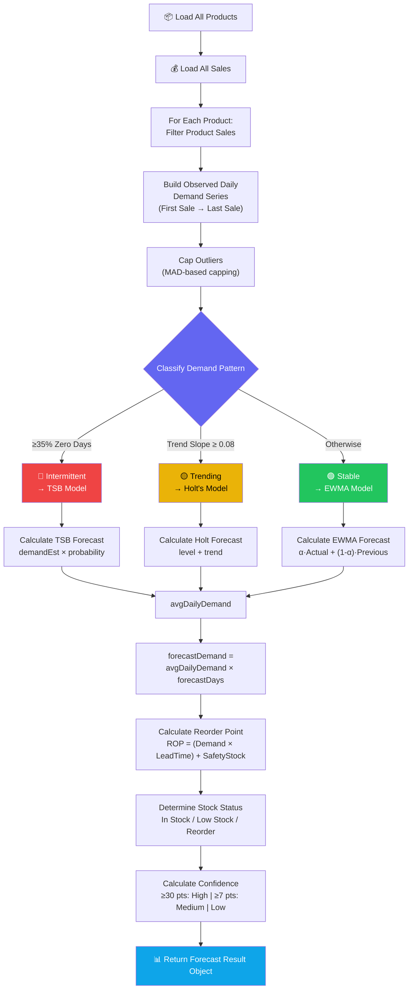
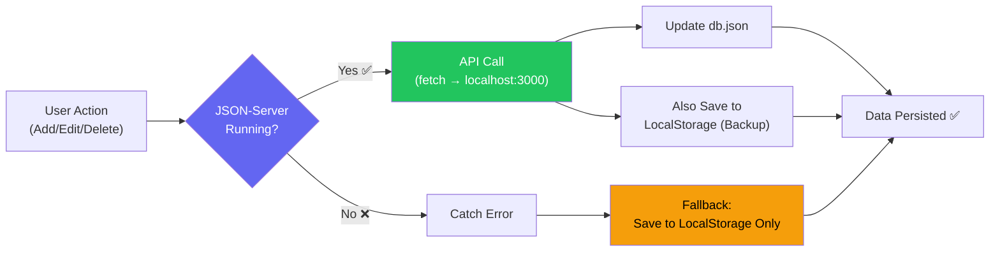
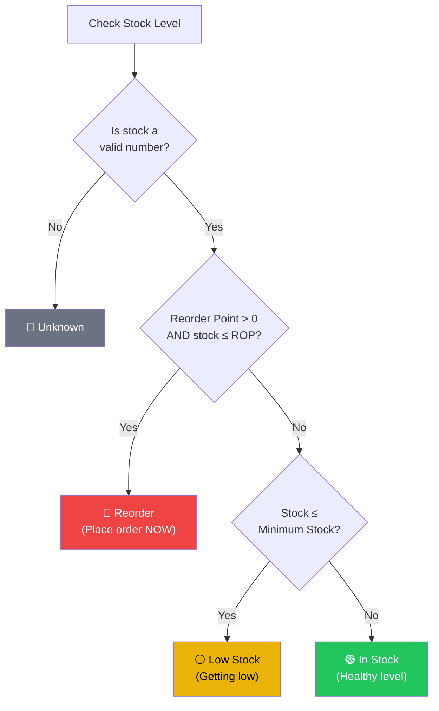
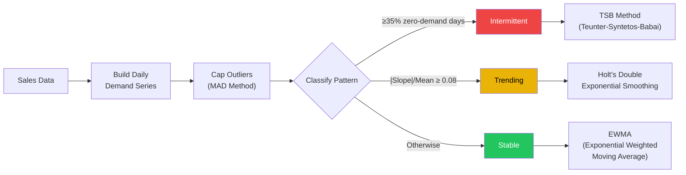
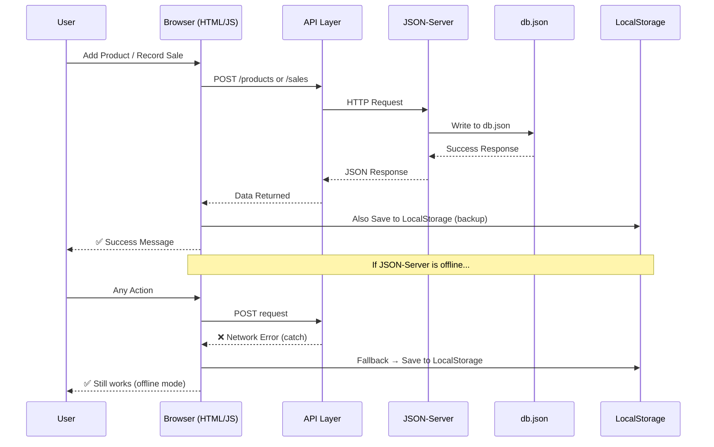

<p align="center">
  
</p>

<h1 align="center">📦 InventoryIQ — AI-Powered Inventory & Reorder Intelligence System</h1>

<p align="center">
  <em>A full-featured Inventory Management, Demand Forecasting & Reorder Point Calculation system built with pure Vanilla JavaScript, JSON-Server, and LocalStorage.</em>
</p>

<p align="center">
  
  
  
  
  
</p>

---

## 📑 Table of Contents

- [Overview](#-overview)
- [Tech Stack](#-tech-stack)
- [Project Architecture](#-project-architecture)
- [How to Run the Project](#-how-to-run-the-project)
- [Folder Structure](#-folder-structure)
- [Application Flow (Flowcharts)](#-application-flow-flowcharts)
- [Pages & Features](#-pages--features)
- [KPI Cards — How They Are Calculated](#-kpi-cards--how-they-are-calculated)
- [Reorder Point — How It Works](#-reorder-point--how-it-works)
- [Demand Forecasting Engine](#-demand-forecasting-engine)
- [Data Flow Architecture](#-data-flow-architecture)
- [Step-by-Step Usage Guide](#-step-by-step-usage-guide)
- [Full Example Walkthrough](#-full-example-walkthrough)
- [API Endpoints](#-api-endpoints)
- [License](#-license)

---

## 🌟 Overview

**InventoryIQ** is an intelligent inventory management system that helps businesses:

- **Track products** with real-time stock levels, pricing, and categories
- **Record sales** and automatically decrement stock
- **Forecast demand** using advanced statistical models (EWMA, Holt's, TSB)
- **Calculate reorder points** dynamically based on actual sales data
- **Generate reports** with revenue, profit, and performance analytics
- **Visualize data** through 10+ interactive Chart.js dashboards

> **Key Innovation:** The system uses a **Hybrid Forecast Engine** that automatically classifies each product's demand pattern (Stable / Trending / Intermittent) and selects the optimal forecasting algorithm — no manual configuration needed.

---

## 🛠 Tech Stack

| Layer | Technology | Purpose |
|-------|-----------|---------|
| **Structure** | HTML5 | Semantic page layouts |
| **Styling** | Vanilla CSS3 | Dark-themed glassmorphism UI with animations |
| **Logic** | Vanilla JavaScript (ES6+) | All business logic, DOM manipulation, charts |
| **Backend** | JSON-Server | REST API mock server (CRUD operations) |
| **Database** | `db.json` | Flat-file JSON database for products, sales, users, categories |
| **Fallback** | LocalStorage | Offline data persistence when server is unavailable |
| **Charts** | Chart.js | Line, Bar, Doughnut, Radar, Sparkline charts |
| **Date Picker** | Flatpickr | Enhanced date selection on sales forms |
| **Fonts** | Google Fonts | Plus Jakarta Sans, Inter, IBM Plex Mono |

---

## 🏗 Project Architecture

```
┌──────────────────────────────────────────────────────────────┐
│                    InventoryIQ System                        │
├──────────────────────────────────────────────────────────────┤
│                                                              │
│   ┌─────────────┐    ┌──────────────┐    ┌──────────────┐   │
│   │  Landing     │    │   Auth       │    │   Dashboard  │   │
│   │  Page        │───▶│  (Login/     │───▶│   (12 KPIs)  │   │
│   │  index.html  │    │  Signup)     │    │  10+ Charts  │   │
│   └─────────────┘    └──────────────┘    └──────┬───────┘   │
│                                                  │           │
│         ┌────────────────┬───────────────┬───────┤           │
│         ▼                ▼               ▼       ▼           │
│   ┌──────────┐    ┌──────────┐    ┌──────────┐ ┌──────────┐ │
│   │ Products │    │  Sales   │    │ Forecast │ │ Reorder  │ │
│   │  CRUD    │    │  Entry   │    │  Engine  │ │ Planning │ │
│   └────┬─────┘    └────┬─────┘    └────┬─────┘ └────┬─────┘ │
│        │               │               │            │        │
│        ▼               ▼               ▼            ▼        │
│   ┌──────────────────────────────────────────────────────┐   │
│   │              API Layer (api.js)                       │   │
│   │     productApi.js │ salesApi.js │ categoryApi.js      │   │
│   └────────────────────────┬─────────────────────────────┘   │
│                            │                                  │
│              ┌─────────────┴─────────────┐                   │
│              ▼                           ▼                    │
│   ┌──────────────────┐       ┌───────────────────┐           │
│   │   JSON-Server    │       │   LocalStorage    │           │
│   │   (db.json)      │       │   (Fallback)      │           │
│   │   Port: 3000     │       │   Browser Storage  │           │
│   └──────────────────┘       └───────────────────┘           │
│                                                              │
└──────────────────────────────────────────────────────────────┘
```

---

## 🚀 How to Run the Project

### Prerequisites

- **Node.js** (v16 or higher) — [Download](https://nodejs.org/)
- A modern web browser (Chrome, Firefox, Edge)
- A code editor (VS Code recommended)

### Step 1: Clone the Repository

```bash
git clone https://github.com/2006-Aman/Inventory-Flow.git
cd Inventory-Flow
```

### Step 2: Install Dependencies

```bash
cd phase01
npm install
```

> This installs `json-server` which acts as the backend REST API.

### Step 3: Start the JSON-Server (Backend)

```bash
npm run server
```

This starts the API server at **`http://localhost:3000`** and watches the `data/db.json` file.

You should see output like:
```
JSON Server started on PORT :3000
Resources:
  http://localhost:3000/users
  http://localhost:3000/categories
  http://localhost:3000/products
  http://localhost:3000/sales
```

### Step 4: Open the Application (Frontend)

Open `phase01/index.html` in your browser directly, or use **Live Server** (VS Code extension):

1. Install the **Live Server** extension in VS Code
2. Right-click on `phase01/index.html` → **"Open with Live Server"**
3. The app opens at `http://127.0.0.1:5500/phase01/index.html`

> ⚠️ **Important:** The JSON-Server (Step 3) must be running in the background while you use the app. If the server is stopped, the app automatically falls back to LocalStorage.

### Quick Start Summary

```
Terminal 1 (keep running):    cd phase01 && npm run server
Browser:                      Open index.html with Live Server
```

---

## 📁 Folder Structure

```
Inventory-Reorder-System/
└── phase01/
    ├── index.html              # Landing page (entry point)
    ├── login.html              # Login page
    ├── signup.html              # Registration page
    ├── dashboard.html           # Main dashboard (12 KPIs + 10 charts)
    ├── add-product.html         # Add / Edit product form
    ├── inventory.html           # Product catalog with filters
    ├── sales.html               # Record a new sale
    ├── sales-history.html       # View all past sales
    ├── forecast.html            # Demand forecasting page
    ├── reorder.html             # Reorder planning page
    ├── reports.html             # Business performance reports
    ├── analytics.html           # Advanced analytics
    ├── invoices.html            # Invoice management
    ├── profile.html             # User profile settings
    ├── settings.html            # App settings (currency, theme)
    ├── help.html                # Help & documentation
    ├── api-test.html            # API testing utility
    │
    ├── data/
    │   └── db.json              # Database (users, products, sales, categories)
    │
    ├── js/
    │   ├── api/
    │   │   ├── api.js           # Base API client (fetch wrapper)
    │   │   ├── productApi.js    # Product CRUD API calls
    │   │   ├── salesApi.js      # Sales CRUD API calls
    │   │   ├── categoryApi.js   # Category API calls
    │   │   └── userApi.js       # User API calls
    │   │
    │   ├── forecast/
    │   │   ├── movingAverage.js  # SMA, EWMA, statistics (pure math)
    │   │   ├── forecast.js      # Hybrid Forecast Engine (Holt, TSB, EWMA)
    │   │   └── reorderPoint.js  # ROP calculation & stock status
    │   │
    │   ├── pages/
    │   │   ├── dashboard.js     # Dashboard controller (12 KPIs + charts)
    │   │   ├── addProduct.js    # Add/Edit product form controller
    │   │   ├── inventory.js     # Inventory table + filters
    │   │   ├── sales.js         # Sales entry controller
    │   │   ├── salesHistory.js  # Sales history table
    │   │   ├── forecast.js      # Forecast page controller
    │   │   ├── reorder.js       # Reorder planning controller
    │   │   ├── reports.js       # Reports & analytics controller
    │   │   ├── analytics.js     # Advanced analytics controller
    │   │   ├── invoices.js      # Invoice controller
    │   │   ├── profile.js       # Profile page controller
    │   │   └── settings.js      # Settings controller
    │   │
    │   ├── storage/
    │   │   └── storage.js       # LocalStorage controller (offline fallback)
    │   │
    │   ├── components/
    │   │   ├── sidebar.js       # Sidebar navigation component
    │   │   ├── topbar.js        # Top bar with search & notifications
    │   │   ├── toast.js         # Toast notification system
    │   │   ├── modal.js         # Modal dialog component
    │   │   └── alerts.js        # Alert banner component
    │   │
    │   ├── utils/
    │   │   ├── helpers.js       # Utility functions
    │   │   ├── formatters.js    # Currency & date formatters
    │   │   └── validation.js    # Form validation utilities
    │   │
    │   ├── app.js               # App initialization
    │   ├── config.js             # Configuration constants
    │   ├── landing.js            # Landing page animations
    │   └── transition.js         # Page transition effects
    │
    ├── css/
    │   ├── variables.css         # CSS custom properties (colors, spacing)
    │   ├── style.css             # Global styles
    │   ├── dashboard.css         # Dashboard-specific styles
    │   ├── landing.css           # Landing page styles
    │   ├── inventory.css         # Inventory page styles
    │   ├── sales.css             # Sales page styles
    │   ├── forecast.css          # Forecast page styles
    │   ├── reorder.css           # Reorder page styles
    │   ├── reports.css           # Reports page styles
    │   ├── analytics.css         # Analytics page styles
    │   └── ... (more CSS files)
    │
    ├── assets/
    │   ├── logo.svg              # App logo
    │   ├── icons/                # UI icons
    │   └── images/               # Static images
    │
    └── package.json              # npm config (json-server dependency)
```

---

## 🔄 Application Flow (Flowcharts)

### 1. Complete User Journey



### 2. Sales Transaction Flow



### 3. Forecast Engine Pipeline



### 4. Data Storage Strategy



---

## 📄 Pages & Features

| # | Page | File | Description |
|---|------|------|-------------|
| 1 | **Landing Page** | `index.html` | Animated hero section with feature highlights |
| 2 | **Login** | `login.html` | User authentication with email/password |
| 3 | **Sign Up** | `signup.html` | New user registration |
| 4 | **Dashboard** | `dashboard.html` | 12 KPI cards, 10+ charts, live clock, recent sales |
| 5 | **Add Product** | `add-product.html` | Product form with live preview, auto SKU/barcode |
| 6 | **Inventory** | `inventory.html` | Full product catalog with search, filters, pagination |
| 7 | **Record Sale** | `sales.html` | Sale entry with live total calculation |
| 8 | **Sales History** | `sales-history.html` | Complete sales log with date filters |
| 9 | **Demand Forecast** | `forecast.html` | AI forecast engine results, charts, CSV export |
| 10 | **Reorder Planning** | `reorder.html` | Products needing reorder, recommended quantities |
| 11 | **Reports** | `reports.html` | Revenue, profit, orders analytics with date ranges |
| 12 | **Analytics** | `analytics.html` | Advanced business analytics & trends |
| 13 | **Invoices** | `invoices.html` | Invoice generation & management |
| 14 | **Profile** | `profile.html` | User profile editor |
| 15 | **Settings** | `settings.html` | Currency, theme, preferences |
| 16 | **Help** | `help.html` | In-app documentation & FAQ |

---

## 📊 KPI Cards — How They Are Calculated

### Dashboard KPIs (12 Cards)

The dashboard renders **12 real-time KPI cards** with mini sparkline charts. Here's exactly how each one is calculated:

#### Grid 1 — Primary Metrics

| KPI Card | Formula | Code Logic |
|----------|---------|------------|
| **Total Products** | `allProducts.length` | Count of all products in the database |
| **Inventory Value** | `Σ (stock × sellingPrice)` for each product | Sum of `(stock × sellingPrice)` across all products |
| **Today's Sales** | `Σ revenue` for sales where `date = today` | Filters sales by today's date, sums revenue |
| **30-Day Revenue** | `Σ (quantity × sellingPrice)` for all sales | Total revenue across all sales records |
| **30-Day Profit** | `Σ (quantity × (sellingPrice − costPrice))` | Total profit using per-unit margin × quantity |
| **Avg Daily Demand** | `totalUnits ÷ 30` | Total units sold divided by 30 days |

#### Grid 2 — Operational Metrics

| KPI Card | Formula | Code Logic |
|----------|---------|------------|
| **Orders Logged** | `allSales.length` | Total count of all sale transactions |
| **Forecast Accuracy** | `(1 − (|actual − forecast| ÷ max(actual, forecast))) × 100` | WAPE variance model over last 7 days |
| **Items Running Low** | Count where `stock ≤ reorderPoint AND stock > 0` | Products below reorder threshold but not zero |
| **Out of Stock** | Count where `stock === 0` | Products with zero inventory |
| **Upcoming Reorders** | `lowCount + outOfStockCount` | Sum of low stock + out of stock items |
| **Business Health** | `(safeProducts ÷ totalProducts) × 100` | Percentage of products above reorder point |

### How Forecast Accuracy is Calculated

```
Forecast Accuracy (%) = (1 − Variance) × 100

Where:
  Variance = |Actual7dSales − Forecast7dDemand| ÷ max(Actual7dSales, Forecast7dDemand)

  Actual7dSales   = Total units sold in the last 7 days
  Forecast7dDemand = Σ (forecastDemand per product) from the forecast engine

  Result is clamped between 0% and 99.4%
  If no sales data exists → Accuracy = 0%
```

### Forecast Page KPIs (4 Cards)

| KPI Card | Formula |
|----------|---------|
| **7-Day Demand** | `Σ forecastDemand` across all products (7-day window) |
| **30-Day Demand** | `Σ (averageDailyDemand × 30)` across all products |
| **Reorder Alerts** | Count where `status = "Reorder"` or `stock ≤ reorderPoint` |
| **Forecast Accuracy** | Same WAPE model as dashboard |

### Reorder Page KPIs (4 Cards)

| KPI Card | Condition |
|----------|-----------|
| **Safe Stock** | `stock > reorderPoint AND stock > safetyStock` |
| **Low Stock** | `stock ≤ reorderPoint AND stock > safetyStock AND stock > 0` |
| **Critical** | `stock ≤ safetyStock AND stock > 0` |
| **Out of Stock** | `stock === 0` |

---

## 🎯 Reorder Point — How It Works

### The Formula

```
Reorder Point (ROP) = (Average Daily Demand × Lead Time) + Safety Stock
```

| Variable | Description | Source |
|----------|-------------|--------|
| **Average Daily Demand** | How many units sell per day on average | Calculated by the Forecast Engine (EWMA/Holt/TSB) |
| **Lead Time** | Days it takes for a supplier to deliver new stock | User input when adding a product (default: 0 days) |
| **Safety Stock** | Extra buffer to handle unexpected demand spikes | User input when adding a product (default: 0 units) |

### Example Calculation

```
Product: "Wireless Mouse"
  Average Daily Demand = 5.2 units/day  (calculated by EWMA from sales)
  Lead Time            = 3 days         (supplier delivery time)
  Safety Stock         = 10 units       (buffer for demand spikes)

  ROP = (5.2 × 3) + 10 = 15.6 + 10 = 26 units (rounded to 26)

  Meaning: When stock drops to 26 or below → TRIGGER REORDER ALERT
```

### Stock Status Decision Logic



### How ROP Updates Dynamically

The Reorder Point is **not static** — it recalculates every time the Forecast or Reorder page loads:

1. The **Forecast Engine** runs on all products
2. It computes `averageDailyDemand` from actual sales history
3. It plugs this into the ROP formula: `(demand × leadTime) + safetyStock`
4. The result becomes the new, dynamic reorder point
5. Stock status is re-evaluated against this new ROP

---

## 🧠 Demand Forecasting Engine

### How the Hybrid Engine Works

The system doesn't use a single forecasting model. Instead, it **automatically classifies** each product's demand pattern and selects the best algorithm:



### Forecasting Models Explained

#### 1. EWMA (Stable Demand) — `calculateEWMA()`

Used when demand is relatively constant over time.

```
Formula:  S_t = α × Y_t + (1 − α) × S_{t-1}

Where:
  S_t   = Smoothed value at time t (forecast)
  Y_t   = Actual demand at time t
  α     = 0.3 (smoothing factor — higher = more weight on recent data)
  S_{t-1} = Previous smoothed value
```

#### 2. Holt's Double Exponential Smoothing (Trending Demand) — `calculateHoltForecast()`

Used when demand shows an upward or downward trend.

```
Level:   L_t = α × Y_t + (1 − α) × (L_{t-1} + T_{t-1})
Trend:   T_t = β × (L_t − L_{t-1}) + (1 − β) × T_{t-1}
Forecast: F = L_t + T_t

Where:
  α = 0.4  (level smoothing)
  β = 0.2  (trend smoothing)
```

#### 3. TSB Method (Intermittent Demand) — `calculateTSBForecast()`

Used for products that sell sporadically (many zero-demand days).

```
Probability: P_t = α_p × Occurrence_t + (1 − α_p) × P_{t-1}
Demand Size: D_t = α_d × Actual_t + (1 − α_d) × D_{t-1}  (only when Actual > 0)
Forecast: F = D_t × P_t

Where:
  α_d = 0.3  (demand size smoothing)
  α_p = 0.2  (probability smoothing)
  Occurrence = 1 if sold, 0 if not
```

### Outlier Detection (MAD Method)

Before forecasting, extreme spikes are capped using **Median Absolute Deviation**:

```
1. Sort all demand values
2. Find the Median
3. Calculate MAD = Median of |each value − Median|
4. Upper Limit = Median + (6 × MAD)
5. Any value above Upper Limit is capped to Upper Limit
```

### Confidence Rating

| Data Points (days of history) | Confidence Level |
|-------------------------------|-----------------|
| ≥ 30 days | 🟢 **High** |
| 7 – 29 days | 🟡 **Medium** |
| < 7 days | 🔴 **Low** |

---

## 🔀 Data Flow Architecture

### How Data Moves Through the System



### Database Schema (db.json)

```json
{
  "users": [
    {
      "id": "1",
      "firstName": "Aman",
      "lastName": "Sharma",
      "email": "admin@inventoryflow.com",
      "password": "admin123",
      "role": "System Administrator",
      "organization": "InventoryIQ Systems"
    }
  ],
  "categories": [
    {
      "id": "1",
      "name": "Electronics",
      "description": "Electronic products",
      "status": "Active"
    }
  ],
  "products": [
    {
      "id": "prod_001",
      "name": "Wireless Mouse",
      "category": "Electronics",
      "sku": "E-WM7291",
      "stock": 45,
      "costPrice": 350,
      "sellingPrice": 699,
      "minimumStock": 5,
      "safetyStock": 10,
      "leadTime": 3,
      "status": "In Stock"
    }
  ],
  "sales": [
    {
      "id": "sale_001",
      "productId": "prod_001",
      "productName": "Wireless Mouse",
      "quantity": 3,
      "sellingPrice": 699,
      "costPrice": 350,
      "profit": 1047,
      "customer": "Walk-in Customer",
      "date": "2026-08-19 14:30"
    }
  ]
}
```

---

## 📋 Step-by-Step Usage Guide

### Step 1: Sign Up & Login

1. Open the app → Click **"Get Started"** on the landing page
2. If first time → Click **"Create Account"** → Fill the registration form
3. Login with your email and password
4. You'll be redirected to the **Dashboard**

### Step 2: Add Products to Your Inventory

1. Go to **Add Product** (sidebar → "Add Product" or click ➕)
2. Fill in the product details:

   | Field | Description | Example |
   |-------|-------------|---------|
   | Product Name | Name of the item | "Wireless Mouse" |
   | Category | Product category | "Electronics" |
   | SKU | Auto-generated stock keeping unit | "E-WM7291" |
   | Barcode | Auto-generated barcode number | "8901234567890" |
   | Stock Quantity | Initial inventory count | 100 |
   | Cost Price | What you pay the supplier | ₹350 |
   | Selling Price | What the customer pays | ₹699 |
   | Minimum Stock | Low stock warning threshold | 5 |
   | Safety Stock | Extra buffer for emergencies | 10 |
   | Lead Time (days) | Supplier delivery time | 3 |

3. Click **"Save Product"** — the product is now in your inventory
4. The **Live Preview** panel shows you how the product card will look

### Step 3: Record Sales

1. Go to **Sales** page (sidebar → "Sales")
2. Select a product from the dropdown
3. The **Product Info Card** appears showing: Price, Stock, Profit/Unit, Status
4. Enter the quantity being sold
5. The **Live Total** updates in real-time:
   - Total Amount = Selling Price × Quantity
   - Total Profit = (Selling − Cost) × Quantity
6. Optionally enter customer name and date
7. Click **"Complete Sale"**
8. Stock is automatically decremented
9. If stock drops below Reorder Point → alert is triggered

### Step 4: Check Demand Forecasts

1. Go to **Demand Forecast** page
2. The **Hybrid Forecast Engine** automatically:
   - Analyzes all sales history for each product
   - Classifies demand pattern (Stable/Trending/Intermittent)
   - Selects the best forecasting model
   - Calculates 7-day and 30-day demand forecasts
3. View the **Forecast vs. Actual** chart
4. Check the **Product Breakdown Table** for per-product details
5. Export results as **CSV** for reporting

### Step 5: Monitor Reorder Alerts

1. Go to **Reorder Planning** page
2. View the 4 KPI cards: Safe / Low / Critical / Out of Stock
3. The table shows products that need reordering with:
   - Current Stock vs. Reorder Point
   - Recommended Order Quantity
   - Days Until Stockout
4. Click **"Restock"** to instantly add stock to a product

### Step 6: View Reports

1. Go to **Reports** page
2. Select a date range (30 days, 90 days, custom, all time)
3. View:
   - Total Revenue, Net Profit, Total Orders, Units Sold, Avg Order Value
   - Daily Revenue Bar Chart
   - Revenue by Category Doughnut Chart
   - Monthly Breakdown Table
   - Top Products Ranking Table
4. Export the report as **CSV**

---

## 🎬 Full Example Walkthrough

Here's a complete walkthrough — from adding a product to seeing forecasts:

### Scenario: You run a small electronics store

---

#### 1️⃣ Add a Product

Go to **Add Product** and enter:

```
Name:          Wireless Bluetooth Earbuds
Category:      Electronics
Stock:         50
Cost Price:    ₹800
Selling Price: ₹1,499
Minimum Stock: 5
Safety Stock:  8
Lead Time:     4 days
```

Click **Save Product** ✅

---

#### 2️⃣ Record Multiple Sales Over Several Days

**Day 1 (Aug 15):**

| Product | Qty | Customer | Revenue | Profit |
|---------|-----|----------|---------|--------|
| Bluetooth Earbuds | 5 | Rahul | ₹7,495 | ₹3,495 |

**Day 2 (Aug 16):**

| Product | Qty | Customer | Revenue | Profit |
|---------|-----|----------|---------|--------|
| Bluetooth Earbuds | 3 | Walk-in | ₹4,497 | ₹2,097 |

**Day 3 (Aug 17):**

| Product | Qty | Customer | Revenue | Profit |
|---------|-----|----------|---------|--------|
| Bluetooth Earbuds | 8 | Priya | ₹11,992 | ₹5,592 |

**Day 4 (Aug 18):**

| Product | Qty | Customer | Revenue | Profit |
|---------|-----|----------|---------|--------|
| Bluetooth Earbuds | 4 | Walk-in | ₹5,996 | ₹2,796 |

After these sales: **Stock = 50 − 5 − 3 − 8 − 4 = 30 units remaining**

---

#### 3️⃣ Check the Forecast

Go to **Demand Forecast** page. The engine calculates:

```
Daily Demand Series: [5, 3, 8, 4]  (over 4 observed days)

Pattern Classification:
  Zero Demand Ratio = 0%  (no zero-demand days)
  Trend Slope = very slight  → Classified as "Stable"
  Selected Model: EWMA (α = 0.3)

EWMA Calculation:
  S₀ = 5.00
  S₁ = 0.3 × 3 + 0.7 × 5.00 = 4.40
  S₂ = 0.3 × 8 + 0.7 × 4.40 = 5.48
  S₃ = 0.3 × 4 + 0.7 × 5.48 = 5.04

  Average Daily Demand = 5.04 units/day
  7-Day Forecast = 5.04 × 7 = 35.3 units
  30-Day Forecast = 5.04 × 30 = 151.2 units
```

---

#### 4️⃣ See the Reorder Point in Action

```
Reorder Point = (Avg Daily Demand × Lead Time) + Safety Stock
             = (5.04 × 4) + 8
             = 20.16 + 8
             = 28 units (rounded)

Current Stock = 30 units
ROP = 28 units

Since 30 > 28 → Status: "In Stock" ✅ (but very close to reorder!)
```

---

#### 5️⃣ One More Sale Tips the Balance

**Day 5 (Aug 19):** Sell 5 more units

```
New Stock = 30 − 5 = 25 units
ROP = 28 units

Since 25 ≤ 28 → Status: "Reorder" 🔴
```

Now the product appears in:
- ⚠️ Dashboard → "Items Running Low" KPI increments
- 🔔 Reorder Page → Product listed with recommended order quantity
- 📊 Forecast Page → Status pill shows "Low Stock"

---

#### 6️⃣ Restock the Product

Go to **Reorder Planning** → Click **"Restock"** on Bluetooth Earbuds:

```
Recommended Qty = ROP − currentStock + safetyStock
                = 28 − 25 + 8 = 11 units (at minimum)

Enter: 50 units to restock

New Stock = 25 + 50 = 75 units
Status: "In Stock" ✅
```

---

#### 7️⃣ Check Reports

Go to **Reports** page:

```
Total Revenue:    ₹29,980 (from 4 days of sales)
Net Profit:       ₹13,980
Total Orders:     4
Units Sold:       20
Avg Order Value:  ₹7,495
```

---

## 🔌 API Endpoints

The JSON-Server automatically generates REST endpoints from `db.json`:

| Method | Endpoint | Description |
|--------|----------|-------------|
| `GET` | `/products` | Get all products |
| `GET` | `/products/:id` | Get single product |
| `POST` | `/products` | Create new product |
| `PUT` | `/products/:id` | Update product |
| `DELETE` | `/products/:id` | Delete product |
| `GET` | `/sales` | Get all sales |
| `GET` | `/sales/:id` | Get single sale |
| `POST` | `/sales` | Create new sale |
| `PUT` | `/sales/:id` | Update sale |
| `DELETE` | `/sales/:id` | Delete sale |
| `GET` | `/categories` | Get all categories |
| `GET` | `/users` | Get all users |
| `POST` | `/users` | Register new user |

**Base URL:** `http://localhost:3000`

---

## 👤 Default Login Credentials

| Email | Password | Role |
|-------|----------|------|
| `admin@inventoryflow.com` | `admin123` | System Administrator |

---

## 🧩 Key Technical Details

### Multi-User Isolation

- Each registered user gets their own **isolated data scope**
- Products, sales, and categories are filtered by `userId` / `userEmail`
- The admin account (`admin@inventoryflow.com`) sees shared/demo data
- LocalStorage keys are namespaced per user: `inventory_products_{userId}`

### Offline-First Architecture

- All API calls have try-catch wrappers
- On API failure → data is saved/read from LocalStorage
- The **Server Status** indicator shows: 🟢 Connected / 🔴 Offline
- Full functionality works even without JSON-Server running

### Chart.js Visualizations (Dashboard)

| # | Chart | Type | Data Source |
|---|-------|------|-------------|
| 1 | Revenue & Demand Trend | Line (dual axis) | Daily sales aggregation |
| 2 | Top Selling Products | Progress bars | Sales quantity per product |
| 3 | Stock Health Gauge | Doughnut (180°) | Healthy stock ratio % |
| 4 | Monthly Sales | Vertical bar | Monthly revenue aggregation |
| 5 | Category Valuation | Radar | Stock value by category |
| 6 | Category Bubbles | Animated orbit | Category value distribution |
| 7 | Forecast vs. Actual | Line (dual) | 14-day actual vs. 3-day MA |
| 8 | Recent Sales Timeline | Feed list | Latest 5 transactions |
| 9 | 12× Sparklines | Mini line charts | One per KPI card |


<p align="center">
  <strong>Built with ❤️ by <a href="https://github.com/2006-Aman">Aman</a>, <a href="https://github.com/Himanshu151106">Himanshu Sidana</a></strong>
</p>
